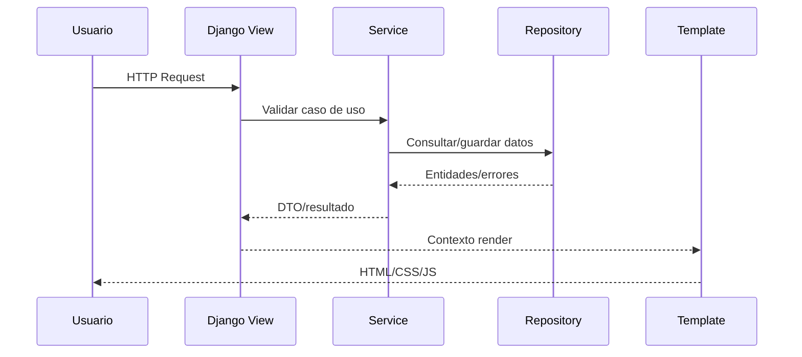

# Design: Bootstrap Template Architecture

## Contexto
`requirements.md` exige Django + PostgreSQL, templates server-rendered, autenticación Django y soporte de imágenes de preguntas. Esta etapa crea cimientos para las demás.

## Decisiones clave
1. **UI template-first**: Django templates + forms como interfaz primaria (sin React/API desacoplada).
2. **Capas obligatorias**: View coordina HTTP, Service reglas, Repository acceso ORM.
3. **Apps por dominio**: `accounts`, `subjects`, `quizzes`, `attempts`, más `core` transversal.

## Modelos/áreas afectadas
- No agrega modelos de dominio definitivos.
- Afecta configuración transversal: templates, static/media, auth redirect, seguridad base.

## Flujo (secuencia) de request web base

## Dependencias
- Ninguna (etapa raíz).

## Tradeoffs
- **Pros**: menor complejidad inicial, time-to-value rápido para MVP.
- **Contras**: interacción rica limitada vs SPA; mitigado con JS progresivo.
