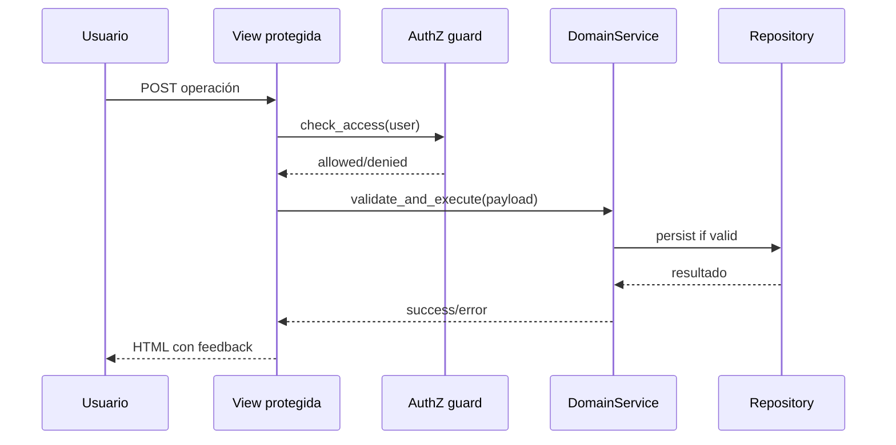

# Design: Validation, Security and Usability Hardening

## Decisiones
1. “Defense in depth”: validar en Form + Service + restricciones de acceso en View.
2. Estándar de errores: mensajes comprensibles para usuario final y logging técnico interno.
3. Checklist de seguridad de Django para entorno local preparado a futura publicación.

## Áreas afectadas
- Servicios de dominios (subjects/quizzes/questions/attempts/accounts).
- Vistas protegidas y carga de archivos.
- Templates de formularios y mensajes.

## Secuencia: operación admin con validación reforzada

## Dependencias
- Etapas 1 a 7 completadas.

## MVP vs fuera de alcance
- MVP: robustez y usabilidad final.
- Fuera: hardening de producción avanzada (WAF, observabilidad full).
