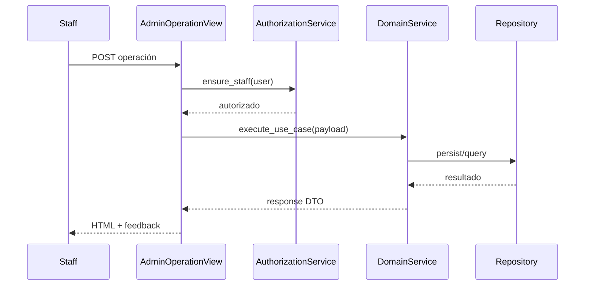

# Design: Admin Management UI

## Decisiones
1. Separar “admin de negocio” (templates custom) de “admin de plataforma” (Django Admin usuarios).
2. Autorización centralizada en servicio/mixin reusable para staff.
3. Reutilizar servicios de dominio existentes para evitar lógica duplicada.

## Modelos/áreas afectadas
- Sin nuevos modelos obligatorios; reutiliza Subject/Quiz/Question/Option/Attempt.
- Afecta navegación y permisos de vistas administrativas.

## Secuencia: acceso a operación admin

## Dependencias
- Requiere dominios funcionales previos completos.

## MVP vs fuera de alcance
- MVP: gestión staff suficiente para operación local.
- Fuera: permisos por recurso y trazabilidad avanzada.
