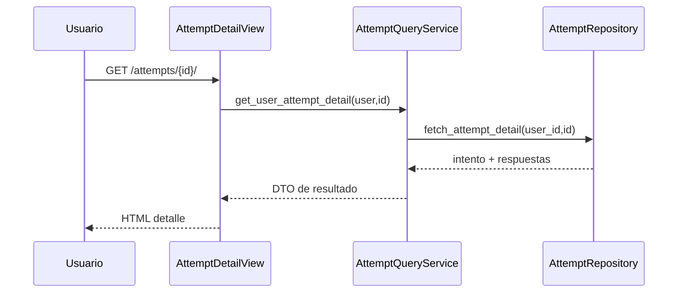

# Design: Attempt History and Results

## Decisiones
1. Consultas de historial en `AttemptRepository` con filtro obligatorio por `user_id` para usuarios comunes.
2. Servicio separa “self history” de “admin review” para no mezclar políticas.
3. Templates muestran feedback por pregunta sin modificar resultados históricos.

## Modelos afectados
- Reutiliza `QuizAttempt`, `AttemptAnswer`, `AttemptAnswerOption`.

## Secuencia: ver detalle de intento propio

## Dependencias
- `implement-quiz-taking-flow`.

## MVP vs fuera de alcance
- MVP: historial/resultado consultable.
- Fuera: tendencias, comparativas y ranking.
