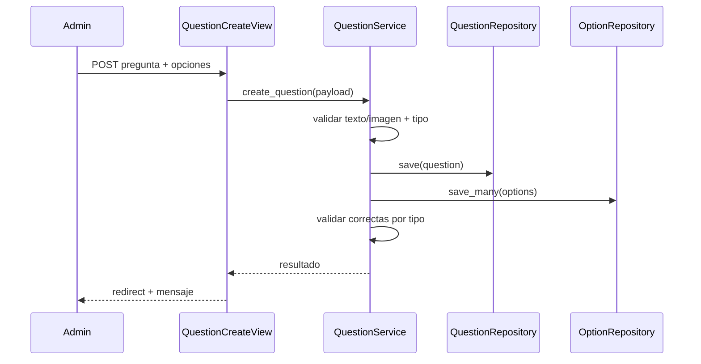

# Design: Questions and Options Domain

## Decisiones
1. Validación de reglas de correctas en Service, no en View.
2. Persistencia de imagen en `ImageField/FileField` y validadores.
3. Orden explícito por `position` en repositorios para experiencia consistente.

## Modelos afectados
- `Question(quiz_id, statement, image_path, question_type, score, explanation, position)`
- `QuestionOption(question_id, text, is_correct, position)`

## Secuencia: guardado de pregunta con opciones

## Dependencias
- `implement-subjects-and-quizzes-domain` para relación `Question -> Quiz`.

## MVP vs fuera de alcance
- MVP: single/multiple + imagen local.
- Fuera: OCR, banco masivo, randomización.
