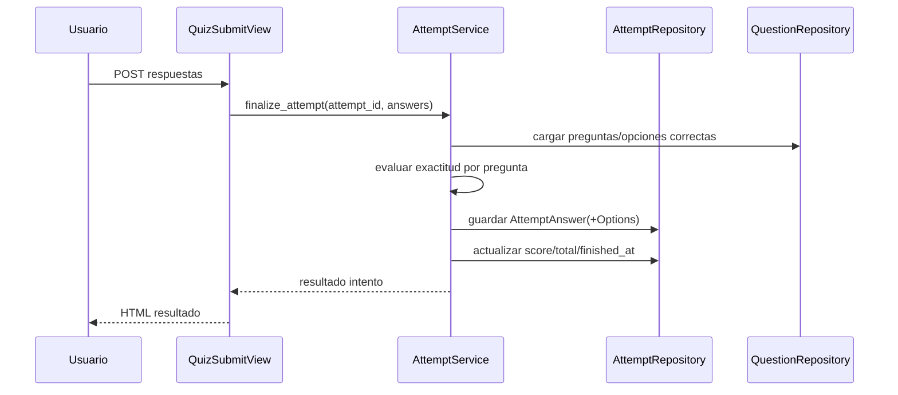

# Design: Quiz Taking Flow

## Decisiones
1. `AttemptService` centraliza orquestación para consistencia transaccional.
2. Repositorios separados para intento, respuesta y opciones seleccionadas.
3. Regla de exact match para `multiple_choice` (sin parcial) aplicada en servicio.

## Modelos afectados
- `QuizAttempt(user_id, quiz_id, started_at, finished_at, score, total_score)`
- `AttemptAnswer(attempt_id, question_id, is_correct, score_obtained)`
- `AttemptAnswerOption(attempt_answer_id, question_option_id)`

## Secuencia: finalizar intento y corregir

## Dependencias
- Subjects/Quizzes, Questions/Options y Accounts completos.

## MVP vs fuera de alcance
- MVP: resolver y corregir.
- Fuera: analytics y modos avanzados de examen.
