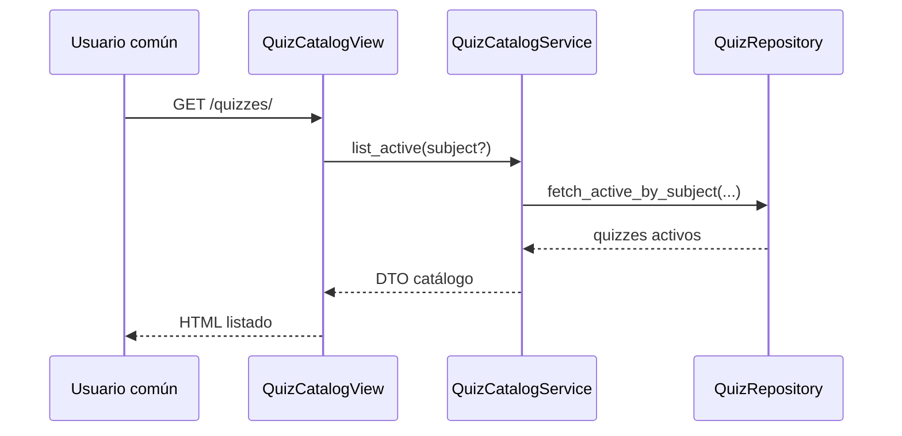

# Design: Subjects and Quizzes Domain

## Decisiones
1. `Subject` y `Quiz` como aggregate roots separados, unidos por FK `Quiz.subject`.
2. Reglas de activación en Service para evitar publicar quizzes inválidos.
3. Repository con métodos diferenciados: administración total vs catálogo público activo.

## Modelos afectados
- `Subject(id, name, description, created_at, updated_at)`
- `Quiz(id, subject_id, name, description, is_active, created_at, updated_at)`

## Secuencia: listado público de quizzes activos

## Dependencias
- Depende de `bootstrap-template-architecture`.

## MVP vs fuera de alcance
- MVP: CRUD y activación básica.
- Fuera de alcance: estadísticas, filtros complejos, permisos granulares.
