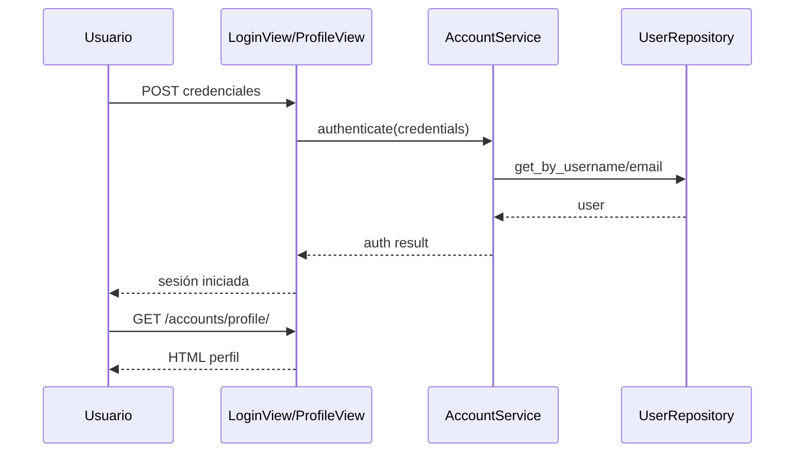

# Design: Web Authentication and User Profile

## Decisiones
1. Reutilizar backend de autenticación Django para minimizar riesgo de seguridad.
2. Encapsular reglas de creación de cuenta/perfil en `AccountService`.
3. Restricción de vistas privadas por mixins/decorators estándar.

## Modelos afectados
- `User` (modelo Django o custom según setup), con perfil básico y asociación futura a intentos.

## Secuencia: login y acceso a perfil

## Dependencias
- `bootstrap-template-architecture`.

## MVP vs fuera de alcance
- MVP: autenticación clásica web.
- Fuera: IAM avanzado y proveedores externos.
